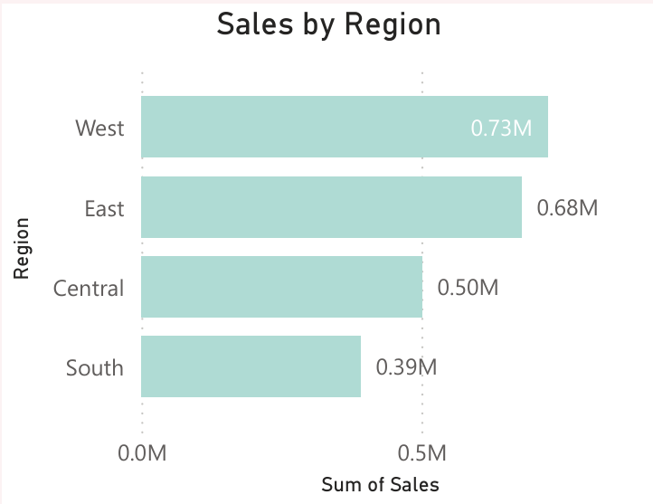

# 📊 Superstore Business Intelligence Dashboard

> A complete Power BI + Python data analysis project to uncover key sales insights from a global retail dataset.

---

## 🧾 Project Overview

This project focuses on analyzing a **retail transactional dataset** from the [Kaggle Superstore dataset](https://www.kaggle.com/datasets/vivek468/superstore-dataset-final).  
It includes end-to-end steps from data cleaning, KPIs, visual dashboards, and real-world business insights.

---

## 🛠️ Tools & Skills Used

- **Power BI** – Dashboard visuals, filters, KPI cards
- **Python (Pandas, Matplotlib, Seaborn)** – Initial EDA & grouping
- **SQL-style Pandas** – Customer-level & region metrics
- **GitHub** – Project version control
- **Markdown** – Documentation & insight storytelling

---

---
## 📈 Key Dashboards

### 📍 Sales by Region  


### 📈 Monthly Sales Trend  


### 🧾 Profit by Segment  


---

## 🔍 Business Insights

- 🧍‍♀️ **Consumer Segment** leads in both sales and order volume.
- 🌍 **West** and **East** regions dominate total revenue.
- 🕒 Peak sales observed in **late 2017** — possibly due to seasonal offers.
- 🪑 **Furniture > Tables** category shows high sales but negative profit — suggesting possible over-discounting or supply chain issues.
- 📉 High discounts often correlate with **profit losses**.

---

## 📌 Key Metrics Used

- 💰 **Total Sales**  
- 🏷️ **Average Discount Rate**  
- 🧍‍♂️ **Top Customers by Revenue**  
- 🛒 **Category & Sub-category Performance**  
- 🌐 **Region-wise Profit Distribution**

---

## ✅ Project Outcomes

✔️ Cleaned and explored 10,000+ rows  
✔️ Designed a fully-interactive Power BI dashboard  
✔️ Extracted real-world insights useful for sales & marketing teams  
✔️ Documented and published to GitHub  
✔️ Resume-ready project with visuals & interpretation

---

## 📌 Resume Snippet 

```markdown
📊 Superstore BI Dashboard (Power BI + SQL + Python)  
Built an interactive sales dashboard analyzing regional profit, category loss, and customer trends  
• Tools: Power BI, Pandas, Seaborn, GitHub  
• Created slicers, KPI cards, and insights from 10K+ orders  


