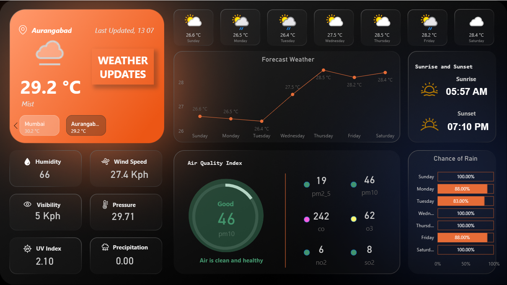
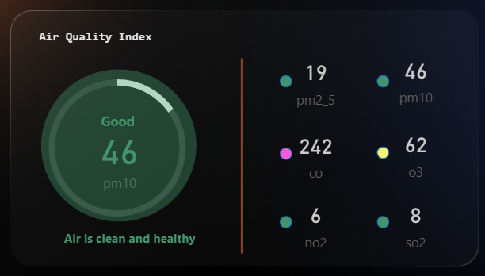

# 🌤️ Weather Dashboard using Power BI + WeatherAPI

This project is an interactive and visually rich **Weather Monitoring Dashboard** built in **Power BI**, using real-time data from the [WeatherAPI.com](https://www.weatherapi.com/) free weather API.

It showcases my skills in data integration, visualization design, and UI/UX for data storytelling.

---

## 📸 Dashboard Preview

| Overview | Forecast & AQI |
|----------|----------------|
|  |  |

---

## 🔧 Features

- 🌍 Current Weather: City, temperature, condition, humidity, wind, visibility
- 📈 7-Day Forecast with line chart + icons
- 🌅 Sunrise & Sunset times
- 💨 Air Quality Index: PM2.5, PM10, CO, O3, NO2, SO2
- 🌧️ Daily Rain Probability (%)
- ⚡ UV Index, Pressure, Wind Speed
- 📱 Interactive city switch (e.g., Mumbai ↔ Aurangabad)

---

## 🌐 Data Source

**Weather API**  
🔗 [https://www.weatherapi.com](https://www.weatherapi.com)

- Endpoint used: `/current.json` and `/forecast.json`
- Format: JSON
- Data pulled using an API key and imported into Power BI using **Web connector** or a script

---

## 🧠 Skills Demonstrated

- ✅ Data Integration using API
- ✅ Power BI Data Model Design
- ✅ Dashboard Design Principles (Layout, Color, UX)
- ✅ Custom KPIs, DAX Measures, and Cards
- ✅ Weather & AQI Interpretation
- ✅ Slicing and Forecast Visualization

---

## 💡 Future Enhancements

- Add more cities (via slicer or dropdown)
- Auto-refresh with scheduled API fetch
- Historical trends (if API supports it)

---

## 📬 Contact

📧 Email: hemant.777karpe@gmail.com  
🔗 LinkedIn: [Hemant-karpe](https://www.linkedin.com/in/hemant-karpe)

---

⭐ If you found this project useful or inspiring, please consider giving it a star!

